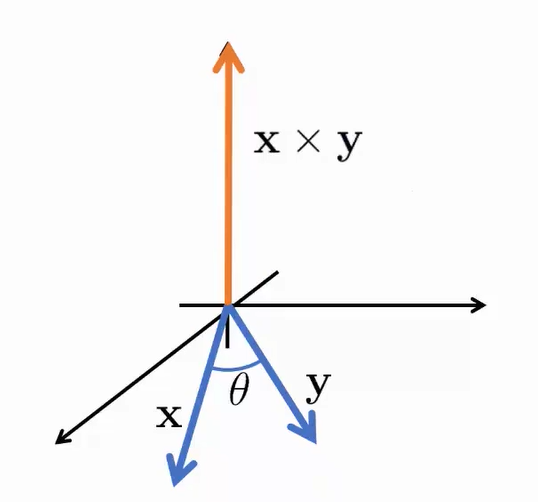
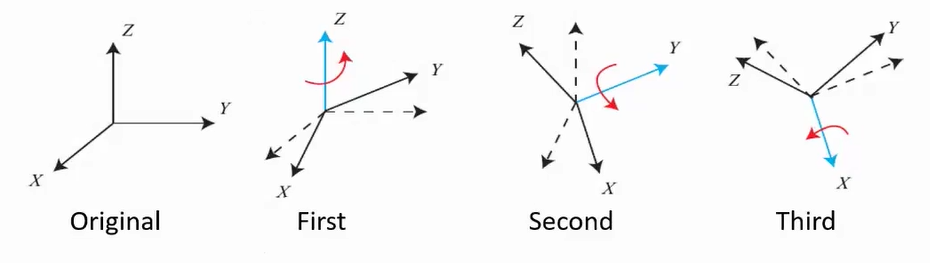
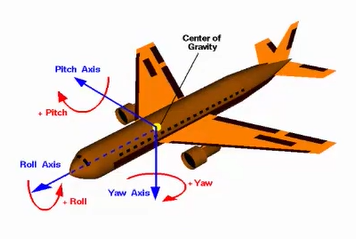
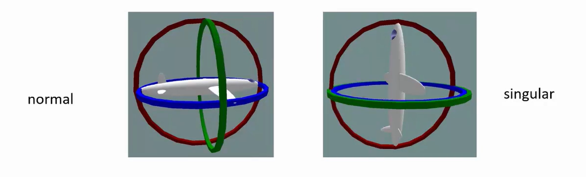
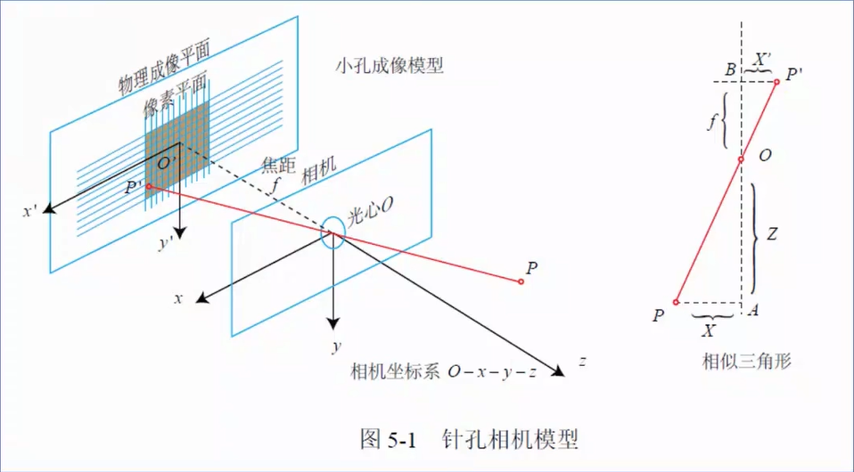
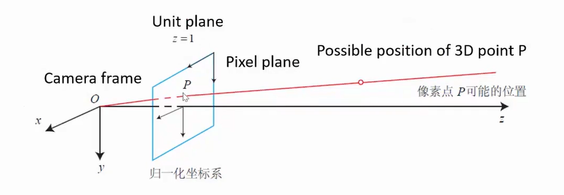
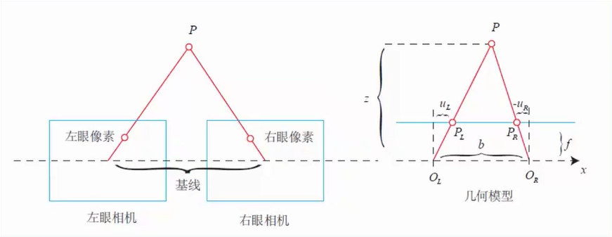
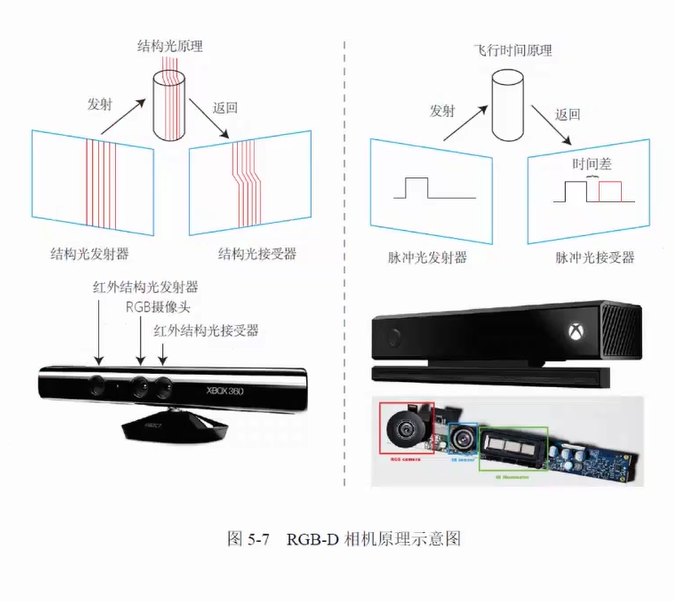
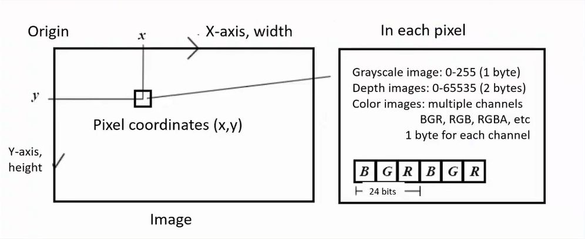

#! https://zhuanlan.zhihu.com/p/409157901
# SLAM 学习日志 -- 2

# Math Basics for SLAM -- 3D Geometry 

## Vector (向量)

Vectors represent points in an N dimensional space:

$$
x =
\left\lgroup
        \begin{array}{lr}
            x_1\\
            x_2\\
            x_3\\
            ...\\
            x_n
        \end{array}
\right\rgroup
\in \Reals^n
$$

Vector calculation in 3D geometry

* Scalar multiplication
    $$
    \begin{aligned}    
    \vec{A} &=  (x, y, z)\\
    s\vec{A} &= (sx, sy, sz)
    \end{aligned}
    $$
* Addition/ Subtraciton
    $$
    \begin{aligned}        
    \vec{A} &=  (x_1, y_1, z_1)\\
    \vec{B} &=  (x_1, y_1, z_1)\\
    \vec{A} + \vec{B} &= (x_1 + x_2, y_1 + y_2, z_1 + z_2)
    \end{aligned}
    $$
* Length
    $$
    \begin{aligned}        
    \vec{A} &= (x, y, z)\\
    \|A\| &= \sqrt{x^2 + y^2 + z^2}
    \end{aligned}
    $$
* Normalizated vetor
    $$
    \bar{A} = \frac{\vec{A}}{\|A\|}
    $$
* Dot production
    $$
    \vec{A}\cdot{\vec{B}} = \|A\|\|B\|cos(\theta)
    $$
* Cross product

$$
\vec{A}\times{\vec{B}} = \|A\|\|B\|sin(\theta)\vec{n}
$$ 

$$
\begin{align*}
    \vec{a}\times\vec{b} &= 
    \left\lbrack
        \begin{array}{lr}
            i && j && k\\
            a_1 && a_2 && a_3\\
            b_1 && b_2 && b_3\\
        \end{array}
    \right\rbrack =
    \left\lbrack
        \begin{array}{lr}
            a_2b_3 - a_3b_2\\
            a_3b_1 - a_1b_3\\
            a_1b_2 - a_2b_1\\
        \end{array}
    \right\rbrack\\ &= 
    \left\lbrack
        \begin{array}{lr}
            0 && -a_3 && a_2\\
            a_3 && 0 && -a_1\\
            -a_2 && a_1 && 0\\
        \end{array}
    \right\rbrack\vec{b}\triangleq
    \vec{a}\land\vec{b}
\end{align*}
$$

## Frame Transform (坐标变换)

> 这里的内容涉及了很多复杂的矩阵计算，但在 `ROS` 的 `TF` 包中已经集成好了这类的坐标变换的方法，直接调用应该就可以了。所以相关内容便不再介绍了。 

## Eluer Angles (欧拉角)

Any rotation can be decomposed into three principal rotations

However the order of axis can e defined very differently:
* Roll - Pitch - Yaw(in navigation)
* Spin - nutation - procession in mechanics

**Gimbal lick**

Gimbal lock ocurred when pitch = 90 degree, yaw and roll ring will be in line.

> 在我们仅仅使用 3 个参数去定义一个物体的姿态的时候会出现很多的问题，比如让我指定物体在 Roll 方向上旋转到 +30°，它可能顺时针转过去，也可能逆时针转过去。在 Pitch = 90° 的时候会发生 Gimbal Lock，这时 Roll 和 Yaw 的运动环会重叠。

## Quaternions (四元数)

In 2D case, we can use (unit) complex numbers to denote retations.

$$
z = x + iy = \rho e^{i\theta}
$$

Multiply i to rotate 90 degrees.

In 3D case:

$$
\begin{aligned}
    q &= q_0 + q_1i + q_2j + q_3k\\
    q &= [s,v]\\
    s &= q_0\in\Reals\\
    v &= [q_1,q_2,q_3]^{T}\in\Reals
\end{aligned}
$$

> 有关四元数的计算，在 ROS 中也有相关的函数，直接提供了欧拉角转换四元数的方法，以及四元数的计算。因此，不再对四元数进行更多的记录。

## Cameras

### Pin - hole cameras (单目相机、针孔相机)

**公式推导：**

by similar triangles:

$$
\frac{Z}{f} = -\frac{X}{X'} = -\frac{Y}{Y'}
$$

Flip to the font:(一般相机都会自动做这步反向操作)

$$
\frac{Z}{f} = \frac{X}{X'} = \frac{Y}{Y'}
$$

Rearrange it:

$$
\begin{aligned}    
X' = f\frac{X}{Z}\\
Y' = f\frac{Y}{Z}\\
\end{aligned}
$$

From image plane to pixels:

$$
\left\{
        \begin{array}{lr}
        u = \alpha X' + c_x\\
        v = \beta Y' + c_y\\
        \end{array}
\right. 
$$

Take into:

$$
\begin{aligned}    
X' = f\frac{X}{Z}\\
Y' = f\frac{Y}{Z}\\
\end{aligned}
$$

Then we get:

$$
\left\{
    \begin{array}{lr}
        \begin{aligned}       
            u &= f_x\frac{X}{Z} + c_x\\
            v &= f_y\frac{Y}{Z} + c_y\\
        \end{aligned}
    \end{array}
\right. 
$$

**最终结果：**

* Pin-hole models:
$$
\left\{
    \begin{array}{lr}
        \begin{aligned}       
            u &= f_x\frac{X}{Z} + c_x\\
            v &= f_y\frac{Y}{Z} + c_y\\
        \end{aligned}
    \end{array}
\right. 
$$

* Matrix Form:

$$
\left\lgroup
    \begin{array}{lr}
        u\\v\\1
    \end{array}
\right\rgroup =
\left\lgroup
    \begin{array}{lr}
        f_x & 0 & c_x\\
        0 & f_y & c_y\\
        0 & 0 & 1\\
    \end{array}
\right\rgroup =
\left\lgroup
    \begin{array}{lr}
        X\\Y\\Z
    \end{array}
\right\rgroup \triangleq
\frac{1}{Z}KP
$$

K is called as intrinsic camera matrix(相机的内置参数矩阵)
* which is fixed for each real camera
* And can be calibrated before running slam.

> 但是在这个拍摄的过程中，z 被消除了，丢失了距离的信息。

There's another rotation and translation form the world to the camera.

$$
\begin{aligned}
    ZP_{uv} = Z
    \left\lbrack
    \begin{array}{lr}
        u\\v\\1
    \end{array}
    \right\rbrack
    = K(RP_w + t) = KTP_w
\end{aligned}
$$

Here R, t or T is called as extrinsic(外参)

* Note we assume the homogeneous coordinates are cast to non-homogenous coordinates automatically
* In SLAM, the extrinsic R, t is our estimate purpose

**Summary**

Projection orders: world -> camera -> unit plane -> pixels

**Distortion(畸变)**

在摄像过程中，相机会产生一定的畸变。

> 一般来说，畸变时由于凸透镜边缘效果产生的，一般来说我们可以对 unit plane 上的图像使用多项式来修正畸变。

* Mathematic form

$$
\begin{aligned}
    x_{distorted} & = x(1 + k_1r^2 + k_2r^4 + k_3r^6)\\
    y_{distorted} & = y(1 + k_1r^2 + k_2r^4 + k_3r^6)
\end{aligned}
$$

Radial distortion

$$
\begin{aligned}
    x_{distorted} & = x + 2p_1xy + p_2(r^2 + 2x^2)\\
    y_{distorted} & = y + 2p_1(r^2 + 2y^2) + p_2xy
\end{aligned}
$$

tangential distortion

Put them together

$$
\begin{aligned}
    x_{distorted} & = x(1 + k_1r^2 + k_2r^4 + k_3r^6) + 2p_1xy + p_2(r^2 + 2x^2)\\
    y_{distorted} & = y(1 + k_1r^2 + k_2r^4 + k_3r^6) + 2p_1(r^2 + 2y^2) + p_2xy
\end{aligned}
$$

### Stereo canmera(双目相机)

> 可以看成时两个双目相机。由双目相机，我们就可以求出物体距离相机的距离。

$$
\begin{aligned}
    z & = \frac{fb}{d} \\
    d & = u_L - u_R
\end{aligned}
$$

> 所以，一般来说，双目相机的基线距离长，看到的东西会更远。

### RGB - D Cameras

### Images

* 2D arrays stored in computer
* Usually 0 - 255 (1 byte) grayscale values after quantification

