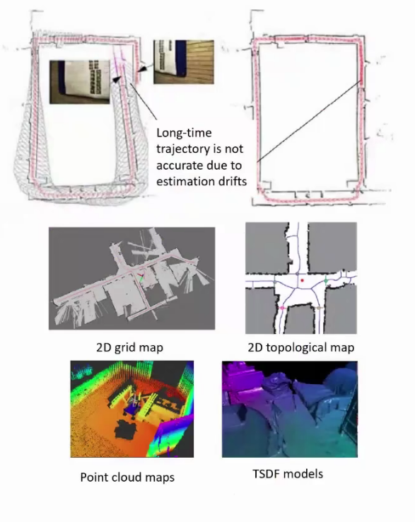

#! https://zhuanlan.zhihu.com/p/408931586
# SLAM 学习日志 -- 1 
# SLAM 框架结构

## Preliminary Knowledge:

我们主要关注的 Slam 方法有激光 Slam 和 视觉 Slam

基于视觉的 Slam 有一个开源的项目 -- ORB-SLAM3， 这是一个可以做稀疏特征点的 VSLAM 框架。

还有 Dirct Sparse Odometry 做的 Semi-dense reconstruction ，通过直接法可以使用稠密点云的 SLAM。效果比较好，但是代码质量较差，难以修改。

## Framwork of SLAM :

两个最关键的点：

自我定位和获取地图（建图），两者不可分割。

SLAM框图

 

SLAM框图补充

 

> 视觉SLAM建图过程讲解：
> 首先通过传感器获得大量的数据，在前端会做视觉里程计，即局部通过视觉数据分析做出的路线规划，是一个短时间内的数据处理层，前端的视觉里程计，短时间内看起来比较准确，但会有累计误差存在，（比如要求机器人左转90°但实际转动角度小为89°，多次的转动会导致巨大的累计误差）因此需要后端来处理，处理过程为滤波和优化处理，具体的会在后面的内容讲解。建图前的最后一部是回环检测，可以使用`CNN`，`Deep Learning`等技术完成。

Two View Method

 

* Visual odometry 
  * Motion estimation between adjacent frames
  * Simpliest: two-view geometry
* Method
  * Feature method
  * Direct method
* Backend
  * Long-term trajectory and map estimation
  * Map: Maximum of a Posteri
  * Filters/ Graph Optimization
* Loop closing
  * Correct the drift in estimation
  * Loop detection and correction
* Mapping
  * Generate globally consistent map for navigation/ planning/ comuunication/ visualization etc
  * Grid/ topological/ hybrid maps
  * Point cloud/ Mesh/ TSDF

Two View Method

 

### Mathematical representation of visual SLAM

To assume a camera is moving in 3D sapce, but measurements are taken at discrete times:

$$
\begin{equation}
\left\{
        \begin{array}{lr}
        x_k = f(x_{k-1},u_k,w_k) & Motion Model\\
        z_{k,j} = h(y_i,x_k,v_k,j) & Observation Model\\
        \end{array}
\right. 
\end{equation}
$$

 Non-linear form 

变量解释：

* $x_K$ 为当前时刻的机器人状态量
* $x_{k-1}$ 为前一时刻的机器人状态量
* $u_k$ 为机器人的控制量
* $w_k$ 为噪声
* 函数 $f()$ 为描述机器人从`k-1`时刻到`k`时刻状态的过程
* $y_j$ 是一个标记点
* $z_{j,k}$ 是对于观测点的数据
* $v_{j,k}$ 为噪声

 

$$
\begin{equation}
\left\{
        \begin{array}{lr}
        x_k = A_kx_{k-1} + B_ku_k + w_k\\
        z_{k,j} = C_jy_j + D_kx_k + v_{k,j}\\
        \end{array}
\right. 
\end{equation}
$$

 Non-linear form 

