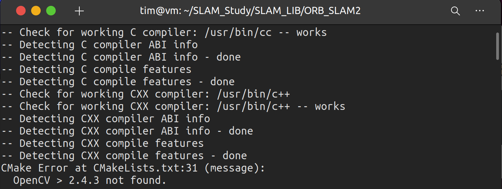

# SLAM 十四讲作业及答案

## Lecture 1

### Q1 SLAM 综述文献阅读

当你对某个研究领域不了解时，最好是从综述文献开始了解这个领域的整体⾯貌。SLAM 作为一个近30 年的研究领域，⾄今也存在着大量的综述、总结类的文章。请阅读本次作业 paper/⽬录下的文章 [1–3]（其中 [3] 是中文文献），了解这个领域的大致情况。如果你的时间有限，可以仅阅读每篇文章的第一章（也就是引⾔一章），然后回答下列问题：

>文献链接：
>链接：https://pan.baidu.com/s/11CKH9p45U8jViunUrv7qBQ 
>提取码：aiic
>我对于其中一些文献解读：
>https://zhuanlan.zhihu.com/p/410263180

1. SLAM 会在哪些场合中用到？⾄少列举三个方向。
2. SLAM 中定位与建图是什么关系？为什么在定位的同时需要建图？
3. SLAM 发展历史如何？我们可以将它划分成哪⼏个阶段？
4. 列举三篇在 SLAM 领域的经典文献。

#### Q1-1

答：
* 增强现实：同时定位与地图构建作为增强现实的关键基础技术, 可以用来在未知环境中定位自身方位并同时构建环境三维地图, 从而保证叠加的虚拟物体与现实场景在几何上的一致性。
* 机器人：在一个未知的环境中实时重建环境的三维结构并同时对机器人自身进行定位。从中又可以细分为无人机和无人驾驶。
* 视觉监控系统。
* 高风险或难航行环境的救援任务。
* 行星、空中、陆地和海洋探索。
* 增强现实应用程序，其中虚拟对象包含在现实世界的场景中。

#### Q1-2

答：
定位和建图是相互依赖的关系。为了精确的定位，我们需要一张正确且精确的地图，但是为了获得一个好的地图，当各种元素添加到地图的时候又需要正确的定位。

#### Q1-3

答：
* 1985-1990年，Chatila和Laumond提出以并发的方式进行映射和定位，并给它起了一个名字：SLAM
* 2002-2009，外部感受和本体感受用于从环境构建地图。 外部感受器：声纳、激光测距、照相机、GPS。 所有这些传感器都很嘈杂，而且范围能力有限。 本体感受传感器：编码器、加速度计和陀螺仪。 它们允许实体获得速度、位置变化和加速度等测量值。 但是由于它们的固有噪声，它们不足以始终对实体的位置进行准确估计，因为误差是累积的。 洞察力。

对于纯视觉而言：
* 视觉导航的第一个作品是基于双目立体配置。(2002, 2003)
* 使用多相机装置的作品。(2010, 2011)
* 带有特殊镜头的相机，如广角（2004）或全向（2008）。
* RGB-D（彩色图像和深度图）传感器。(2011) 一个有前途的替代方案。
  
#### Q1-4

答：
* Smith, R.C. and P. Cheeseman, On the Representation and Estimation of Spatial Uncertainty. International Journal of Robotics Research, 1986. 5
* Se, S., D. Lowe and J. Little, Mobile robot localization and mapping with uncertainty using scale­invariant visual
landmarks. The international Journal of robotics Research, 2002. 21
* Mullane, J., et al., A Random­Finite­Set Approach to Bayesian SLAM. IEEE Transactions on Robotics, 2011

### Q2 CMake 练习

cmake 是一种常用、方便的，用于组织 Linux 下 C++ 程序的工具。有许多库，例如 OpenCV、g2o、Ceres 等，都用 cmake 组织它们的工程。所以，不管是使用别⼈的库，还是编写自己的库，都需要掌握一些 cmake 的基本知识。也许你之前没有听过这个工具，但不要紧，我们准备了阅读材料“books/CmakePractice.pdf”（cmake 实践，由一位北大同学撰写）。请阅读此文的第 1 ⾄ 6 章，并完成以下工作：书写一个由 cmake 组织的 C++ 工程，要求如下：

1. include/hello.h 和 src/hello.c 构成了 libhello.so 库。hello.c 中提供一个函数 sayHello()，调用此函数时往屏幕输出一⾏“Hello SLAM”。我们已经为你准备了 hello.h 和 hello.c 这两个文件，见“code/”⽬录下。
2. 文件 useHello.c 中含有一个 main 函数，它可以编译成一个可执⾏文件，名为“sayhello”。
3. 默认用 Release 模式编译这个工程。
4. 如果用户使用 sudo make install，那么将 hello.h 放⾄/usr/local/include/下，将 libhello.so 放⾄/usr/local/lib/下。请按照上述要求组织源代码文件，并书写 CMakeLists.txt。

>不建议直接查看高博提供的教材，理由为年代久远了。目前 `CMake` 官方提供的文档已经很完善了，英文好的同学可以直接通过下方连接查看。此外，也可以查看知乎上的中文简单版教程。另外，关于 `CMake` `ROS`中的`Catkin_make`似乎是一个更方便的选择。

[官网文档链接](https://cmake.org/cmake/help/latest/guide/tutorial/index.html# "card")

[知乎中文链接](https://zhuanlan.zhihu.com/p/119426899 "card")


### Q3 理解 ORB-SLAM2 框架

ORB-SLAM2 是⼀个⾮常经典的视觉 SLAM 开源⽅案，它可以作为你学习 SLAM 的范本。但是现在我们还没有讲解很多关于视觉 SLAM 的知识，所以仅从代码⼯程⾓度上来了解 ORB-SLAM2。请按照提⽰完成以下⼯作。
1. 从 github.com 下载 ORB-SLAM2 的代码。地址在：https://github.com/raulmur/ORB_SLAM2.提⽰：在安装 git 之后，可以⽤ git clone https://github.com/raulmur/ORB_SLAM2 命令下载ORB-SLAM2。下载完成后，请给出终端截图。
2. 此时我们不着急直接运⾏ ORB-SLAM2，让我们⾸先来看它的代码结构。ORB-SLAM2 是⼀个cmake ⼯程，所以可以从 CMakeLists.txt 上⾯来了解它的组织⽅式。阅读 ORB-SLAM2 代码⽬录下的 CMakeLists.txt，回答问题：
(a) ORB-SLAM2 将编译出什么结果？有⼏个库⽂件和可执⾏⽂件？
(b) ORB-SLAM2 中的 include, src, Examples 三个⽂件夹中都含有什么内容？
(c) ORB-SLAM2 中的可执⾏⽂件链接到了哪些库？它们的名字是什么？
你会发现 ORB-SLAM2 从代码组织⽅式来看并不复杂。实际上⼤部分中⼩型库都不会很复杂，⽽更⼤的库可能在 CMakeLists.txt 中有各种各样的兼容性检查，确保它们在各个平台上都能顺利运⾏。

#### Q3-2a

答：

编译后会生成下列可执行文件：

* gbd_tum
* stereo_kitti
* stereo_euroc
* mono_tum
* mono_kitti
* mono_euroc

一个库文件： lib*.so

#### Q3-2b

Example 共有4个例子：

* Monocular
* RGB-D
* ROS
* Stereo

`src`中包含着 `ORB-SLAM2` 库的所有源文件；
`include`中包含着 `ORB-SLAM2` 库中的所有头文件。

#### Q3-2c

可执行文件链接的第三方库有：

* OpenCV_LIBS
* EIGEN3_LIBS
* Pangolin_LIBRARIES
* DBoW2
* g2o

生成库： libORB_SLAM2.so

### Q4 使用摄像头或视频运行 ORB-SLAM2

了解⼀样东西最快的⽅式是⾃⼰上⼿使⽤它，不要担⼼弄坏你的笔记本，⼤部分时候它都是你可靠的伙伴。这个作业中，我将指导你⽤⾃⼰的笔记本摄像头读取到的图像，来运⾏ ORB-SLAM2，看看它能不能实际⼯作。你也可以外接⼀个 usb 摄像头，这会让你的⼿更加灵活⼀些（不⽤费⼒端着笔记本到处跑）。或者，如果你的电脑碰巧没有摄像头/摄像头故障了/你正在⽤虚拟机，那我们也可以在事先录制好的⼀段视频中运⾏ ORB-SLAM2（见 code/myvideo.mp4，这是我在特蕾西亚草坪散步的时候⽤⼿机拍摄的⼩视频）。

由于我们还没有讲过任何关于 OpenCV 或者图像⽅⾯的问题，所以本节我给你写好了⼀个 myslam.cpp⽂件（如果你使⽤录制视频，请⽤ myvideo.cpp）
。这个⽂件会打开你⾃带的摄像头（或视频），读取图像，并交给 ORB-SLAM2 处理。由于你现在已经了解 cmake 原理了，所以我要请你⾃⼰来思考如何将这个⽂
件与 ORB-SLAM2 结合起来。相信我，这件事并不难。myslam.cpp 和 myvideo.cpp ⽂件见本次作业的code/⽂件夹下。

下⾯是本题的提⽰：

1. 为了实际运⾏ ORB-SLAM2，你需要安装它的依赖项，并通过它本⾝的编译。它的依赖项见它⾃⼰的 github 主页，请按照主页上的提⽰安装好 ORB-SLAM2 的依赖项。具体来说，对于 pangolin（⼀个 GUI 库），你需要下载并安装它，它同样是个 cmake ⼯程，所以我不必谈怎么编译安装的细节了。对于 opencv 和 eigen3，你可以简单的⽤⼀⾏命令来解决：

```
sudo apt-get install libopencv-dev libeigen3-dev libqt4-dev qt4-qmake libqglviewer-dev libsuitesparse-dev
libcxsparse3.1.2 libcholmod-dev
```

其中⼀部分是 g2o 的依赖项，现阶段不⽤太在意它的具体内容。⾄此，你应该可以顺利编译 ORB-SLAM2 了，请给出它编译完成的截图。

2. 注意到，ORB-SLAM2 提供了若⼲数据集中的运⾏⽰例，这可以作为我们运⾏⾃⼰摄像头程序的参考，因为它们很相似。对于数据集上的⽰例，ORB-SLAM2 会⾸先读取数据集中的图像，再放到SLAM 中处理。那么对于我们⾃⼰的摄像头，同样可以这样处理。所以最⽅便的⽅案是直接将我们的程序作为⼀个新的可执⾏程序，加⼊到 ORB-SLAM2 ⼯程中。那么请问，如何将 myslam.cpp或 myvideo.cpp 加⼊到 ORB-SLAM2 ⼯程中？请给出你的 CMakeLists.txt 修改⽅案。

3. 现在你的程序应该可以编译出结果了。但是我们现在还没有谈相机标定，所以你还没办法标定你的摄像头。但没有关系，我们也可以⽤⼀个不那么好的标定参数，先来试⼀试效果（所幸 ORB-SLAM2对标定参数不太敏感）。我为你提供了⼀个 myslam.yaml（myvideo.yaml），这个⽂件是我们假想的标定参数。现在，⽤这个⽂件让 ORB-SLAM2 运⾏起来，看看 ORB-SLAM2 的实际效果吧。请给出运⾏截图，并谈谈你在运⾏过程中的体会。注意，本题只需你能运⾏ ORB-SLAM2 即可，并不是说“成功地运⾏ SLAM”。要顺利运⾏ SLAM 还需要⼀些经验和技巧，希望你能在动⼿过程中有所体会。作为建议，请尽量在光照充⾜、纹理丰富的场合下运⾏程序。如果默认参数不合适，你也可以尝试换⼀换参数。


#### Q4-1 ORB-SLAM2 安装过程 小tips 和 踩坑

>ubuntu版本：20.04
>首先安装过程参考：https://blog.csdn.net/learning_tortosie/article/details/79881165

**Tips：**

**1. 每次编译错误后都要手动删除主页面的`build`和两个第三方库中的`build`文件。**
**2. 直接使用`.sh`文件安装报错内容会比较多，可以打开`.sh`文件用命令行手动一步一步的安装，方便查看错误提示。**

**坑一： 找不到 OpenCV**

具体描述：`./build.sh`过程中报错找不到`OpenCV`，但实际上以及安装了`OpenCV4`的最新版本，成功运行了其中的`demo`。



解决方法：彻底删除`OpenCV4`，安装`OpenCV3`。

>删除过错参考：https://blog.csdn.net/Aidam_Bo/article/details/110121752
>并将删除指令全部修改为`opencv4`相关的。无视所有的找不到文件的提示，删除干净为止。

更换版本后可以找到`OpenCV`了，但还有其他问题。

**坑二： “cc1plus: error: bad value (‘tigerlake’)进行‘-march=’开关”编译错误**

具体描述：`./build.sh`过程报错：

```
cc1plus: error: bad value (‘tigerlake’) for ‘-march=’ switch

cc1plus: note: valid arguments to ‘-march=’ switch are: nocona core2 nehalem corei7 westmere sandybridge corei7-avx ivybridge core-avx-i haswell core-avx2 broadwell skylake skylake-avx512 cannonlake icelake-client icelake-server cascadelake bonnell atom silvermont slm goldmont goldmont-plus tremont knl knm x86-64 eden-x2 nano nano-1000 nano-2000 nano-3000 nano-x2 eden-x4 nano-x4 k8 k8-sse3 opteron opteron-sse3 athlon64 athlon64-sse3 athlon-fx amdfam10 barcelona bdver1 bdver2 bdver3 bdver4 znver1 znver2 btver1 btver2 native

cc1plus: error: bad value (‘tigerlake’) for ‘-mtune=’ switch

cc1plus: note: valid arguments to ‘-mtune=’ switch are: nocona core2 nehalem corei7 westmere sandybridge corei7-avx ivybridge core-avx-i haswell core-avx2 broadwell skylake skylake-avx512 cannonlake icelake-client icelake-server cascadelake bonnell atom silvermont slm goldmont goldmont-plus tremont knl knm intel x86-64 eden-x2 nano nano-1000 nano-2000 nano-3000 nano-x2 eden-x4 nano-x4 k8 k8-sse3 opteron opteron-sse3 athlon64 athlon64-sse3 athlon-fx amdfam10 barcelona bdver1 bdver2 bdver3 bdver4 znver1 znver2 btver1 btver2 generic native

make[2]: *** [makefileCommon/compile.core.mk:240: /home/josue/Documents/of_v0.11.0_linux64gcc6_release/libs/openFrameworksCompiled/lib/linux64/obj/Release/libs/openFrameworks/events/ofEvents.o] Error 1

make[1]: *** [makefileCommon/compile.core.mk:204: Release] Error 2

make[1]: Leaving directory '/home/josue/Documents/of_v0.11.0_linux64gcc6_release/libs/openFrameworksCompiled/project'
make: *** [/home/josue/Documents/of_v0.11.0_linux64gcc6_release/libs/openFrameworksCompiled/project/makefileCommon/compile.project.mk:125: Release] Error 2
```

解决方法：更新 `gcc` 和 `g++`，因为`ubuntu 20.04`默认安装的是`gcc-9`和`g++-9`，升级一下就可以了。

```
sudo apt install gcc-10 g++-10
sudo update-alternatives --install /usr/bin/gcc gcc /usr/bin/gcc-10 100 --slave /usr/bin/g++ g++ /usr/bin/g++-10 --slave /usr/bin/gcov gcov /usr/bin/gcov-10
```

>参考：https://stackoverflow.com/questions/64493692/cc1plus-error-bad-value-tigerlake-for-march-switch-compilation-error


升级后可以正常编译第三方库 `DBoW2`


**坑三： 编译文件时报错**

具体描述：`./build.sh`过程报错：


原因：从报错的提示中可以看出，'Eigen::AlignedBit' 已弃用 [-Wdeprecated-declarations]。原因是使用的`Eigen`的版本过高。

解决方法：降低`Eigen`的版本到 3.3.

首先卸载原来的版本：

```
sudo rm -rf /usr/local/include/eigen3
```

然后从[Eigen官方](https://gitlab.com/libeigen/eigen/-/releases)下载`Eigen 3.2.1 .zip`

解压后安装：

```
mkdir build && cd build
cmake -D CMAKE_BUILD_TYPE=Release –D CMAKE_INSTALL_PREFIX=/usr/local ..
make -j
sudo make install
```

>参考：https://blog.csdn.net/u010003609/article/details/100676041

