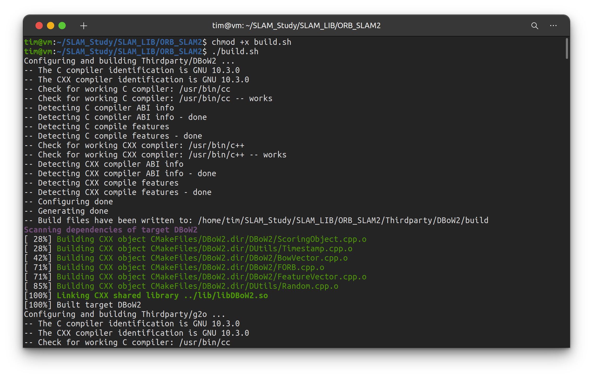

#! https://zhuanlan.zhihu.com/p/411027681
# ubuntu20.04 安装 ORB-SLAM2 踩坑

>ubuntu版本：20.04
>
>首先安装过程参考：https://blog.csdn.net/learning_tortosie/article/details/79881165

**Tips：**

**1. 每次编译错误后都要手动删除主页面的`build`和两个第三方库中的`build`文件。**

**2. 直接使用`.sh`文件安装报错内容会比较多，可以打开`.sh`文件用命令行手动一步一步的安装，方便查看错误提示。**

**3. 安装过程的 `warning` 可以忽略，只关注`error`**

**坑一： 找不到 OpenCV**

具体描述：`./build.sh`过程中报错找不到`OpenCV`，但实际上以及安装了`OpenCV4`的最新版本，成功运行了其中的`demo`。


解决方法：彻底删除`OpenCV4`，安装`OpenCV3`。

>删除过错参考：https://blog.csdn.net/Aidam_Bo/article/details/110121752
>
>并将删除指令全部修改为`opencv4`相关的。无视所有的找不到文件的提示，删除干净为止。

更换版本后可以找到`OpenCV`了，但还有其他问题。

**坑二： “cc1plus: error: bad value (‘tigerlake’)进行‘-march=’开关”编译错误**

具体描述：`./build.sh`过程报错：

```
cc1plus: error: bad value (‘tigerlake’) for ‘-march=’ switch

cc1plus: note: valid arguments to ‘-march=’ switch are: nocona core2 nehalem corei7 westmere sandybridge corei7-avx ivybridge core-avx-i haswell core-avx2 broadwell skylake skylake-avx512 cannonlake icelake-client icelake-server cascadelake bonnell atom silvermont slm goldmont goldmont-plus tremont knl knm x86-64 eden-x2 nano nano-1000 nano-2000 nano-3000 nano-x2 eden-x4 nano-x4 k8 k8-sse3 opteron opteron-sse3 athlon64 athlon64-sse3 athlon-fx amdfam10 barcelona bdver1 bdver2 bdver3 bdver4 znver1 znver2 btver1 btver2 native

cc1plus: error: bad value (‘tigerlake’) for ‘-mtune=’ switch

cc1plus: note: valid arguments to ‘-mtune=’ switch are: nocona core2 nehalem corei7 westmere sandybridge corei7-avx ivybridge core-avx-i haswell core-avx2 broadwell skylake skylake-avx512 cannonlake icelake-client icelake-server cascadelake bonnell atom silvermont slm goldmont goldmont-plus tremont knl knm intel x86-64 eden-x2 nano nano-1000 nano-2000 nano-3000 nano-x2 eden-x4 nano-x4 k8 k8-sse3 opteron opteron-sse3 athlon64 athlon64-sse3 athlon-fx amdfam10 barcelona bdver1 bdver2 bdver3 bdver4 znver1 znver2 btver1 btver2 generic native

make[2]: *** [makefileCommon/compile.core.mk:240: /home/josue/Documents/of_v0.11.0_linux64gcc6_release/libs/openFrameworksCompiled/lib/linux64/obj/Release/libs/openFrameworks/events/ofEvents.o] Error 1

make[1]: *** [makefileCommon/compile.core.mk:204: Release] Error 2

make[1]: Leaving directory '/home/josue/Documents/of_v0.11.0_linux64gcc6_release/libs/openFrameworksCompiled/project'
make: *** [/home/josue/Documents/of_v0.11.0_linux64gcc6_release/libs/openFrameworksCompiled/project/makefileCommon/compile.project.mk:125: Release] Error 2
```

解决方法：更新 `gcc` 和 `g++`，因为`ubuntu 20.04`默认安装的是`gcc-9`和`g++-9`，升级一下就可以了。

```
sudo apt install gcc-10 g++-10
sudo update-alternatives --install /usr/bin/gcc gcc /usr/bin/gcc-10 100 --slave /usr/bin/g++ g++ /usr/bin/g++-10 --slave /usr/bin/gcov gcov /usr/bin/gcov-10
```

>参考：https://stackoverflow.com/questions/64493692/cc1plus-error-bad-value-tigerlake-for-march-switch-compilation-error


升级后可以正常编译第三方库 `DBoW2`



**坑三： 大坑！一堆问题**

>我人都傻了，怎么会有这么多问题？？？

具体描述：


分析：其实上面的一大堆问题主要说了 2 件事情：
1. error: ‘usleep’ was not declared in this scope
2. error: static assertion failed: std::map must have the same value_type as its allocator

解决方法：

问题1：在`include/LoopClosing.h`文件里添加一个头文件`#include <unistd.h>`

问题2：在`LoopCloseing.h`中将代码：

```cpp
typedef map<KeyFrame*,g2o::Sim3,std::less<KeyFrame*>,
        Eigen::aligned_allocator<std::pair<const KeyFrame*, g2o::Sim3> > > KeyFrameAndPose;
```

改为：

```cpp
typedef map<KeyFrame*,g2o::Sim3,std::less<KeyFrame*>,
        Eigen::aligned_allocator<std::pair<KeyFrame *const, g2o::Sim3> > > KeyFrameAndPose;
```

>参考：https://blog.csdn.net/weixin_44387339/article/details/107769353


**最后， build 成功！**

