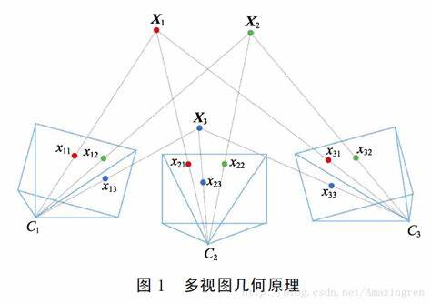
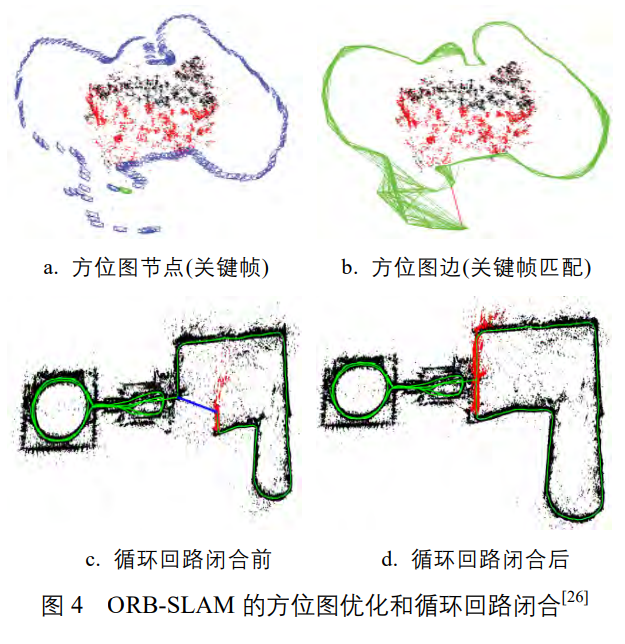
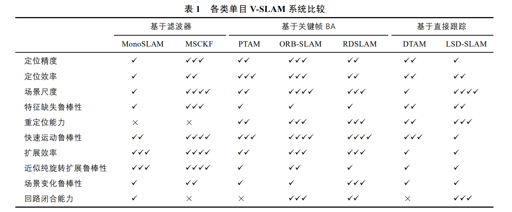

# SLAM 文献阅读笔记

>文献链接：
>链接：https://pan.baidu.com/s/11CKH9p45U8jViunUrv7qBQ 
>提取码：aiic 

## 1. 基于单目视觉的同时定位与地图构建方法综述

## 1.1 V-SLAM 的基本原理

V-SLAM 技术可以根据拍摄的视频信息推断出摄像头在未知环境中的方位, 并同时构建环境地图, 其基本原理为多视图几何原理。

V-SLAM 的目标为同时恢复出每帧图像对应的相机运动参数 $C_1 ... C_n$ , 及场景三维结构 $X_1 ... X_n$。每个相机运动参数 $C_i$ 包含了相机的位置和朝向信息, 通常表达为一个 $3 \times 3$ 的旋转矩阵 $R_i$ 和一个三维位置变量 $p_i$ 。$R_i$ 和 $p_i$ 将一个世界坐标系下的三维点 $X_j$ 变换至 $C_i$ 的局部坐标系

$$
\begin{equation}
    (X_{ij},Y_{ij},Z_{ij})^T = R_i(X_j - p_i)
\end{equation}
$$

进而投影至图像中

$$
\begin{equation}
    h_{ij} = (f_xX_{ij}/Z_{ij} + c_x, f_yY_{ij}/Z_{ij} + c_y)
\end{equation}
$$

>后面还有很多的公式，但我不太能够理解，还需要听高博后面课的内容再细致的学习数学公式部分。

**V-SLAM 的缺陷**

由于 V-SLAM 需要进行图像特征的匹配, 因此其稳定性严重依赖于场景特征的丰富程度. 例如, 相机拍摄一面纯色的白墙, 那么仅从图像无法恢复出相机的运动。

**解决方法**

加入其他传感器，比如：IMU（可以获得加速度、角速度）。这样的 SLAM 称为 VIN(visual-aided inertial navigation) 或 VI-SLAM((visual-inertial SLAM)。

## 1.2 代表性的 V-SLAM 系统

### 1.2.1 基于滤波器的 V-SLAM

> 由于我对于滤波器的基础知识几乎为零，所以只能提出一些我自己的看法。首先基于滤波器的 V-SLAM 方法是将每一个时刻的系统状态（包含位置、姿态等信息）都看作一个高斯概率模型。由于是概率模型，所以系统中的每一个点位都是一个概率云，为了将概率云的体积缩小，精度提高，我们需要使用滤波器。

常用的滤波器模型有：MonoSLAM 和 MSCKF。

### 1.2.2 基于关键帧 BA 的 V-SLAM

此技术的老祖宗是实时的 SFM(structurefrom-motion) 运动推断结构系统，基于此技术开发并开源的 PTAM 是首个基于BA 的单目 V-SLAM 系统。随后基于 PTAM 又开发出了一个更好的开源系统：ORB-SLAM。

ORB-SLAM 相对于 PTAM 有4个特点：

1. ORB-SLAM 选用了 ORB 特征, 基于 ORB 描述量的特征匹配和重定位。
2. ORBSLAM 加入了循环回路的检测和闭合机制, 以消除误差累积。
3. PTAM 需要用户指定 2 帧来初始化系统, 2 帧间既要有足够的公共点, 又要有足够的平移量. 平移运动为这些公共点提供视差(Parallax), 只有足够的视差才能三角化出精确的三维位置. ORB-SLAM 通过检测视差来自动选择初始化的 2 帧。
4. PTAM 扩展场景时也要求新加入的关键帧提供足够的视差, 导致场景往往难以扩展. ORB-SLAM 采用一种更鲁棒的关键帧和三维点的选择机制——先用宽松的判断条件尽可能及时地加入新的关键帧和三维点, 以保证后续帧的鲁棒跟踪; 再用严格的判断条件删除冗余的关键帧和不稳定的三维点, 以保证 BA 的效率和精度

### 1.2.3 基于直接跟踪的 V-SLAM

直接跟踪法(DirectTracking)不依赖于特征点的提取和匹配, 而是直接通过比较像素颜色来求解相机运动, 因此通常在特征缺失、图像模糊等情况下有更好的鲁棒性。

**DTAM**

DTAM 预测一个与当前帧相机方位 $C_t$ 十分接近的虚拟相机 $C_v$，在$C_v$ 下绘制场景三维模型，由此求解 $C_v$ 和 $C_t$ 间的相对运动$\xi_{tv}$. 

>我不是很能理解，所以暂时不写

### 1.2.4 不同方法直接的对比

## 2. Visual simultaneous localization and mapping: a survey

>本文的中文为谷歌翻译提供

### 2.1 Introduction

**Brief Intro**
Simultaneous Localization and Mapping(SLAM) has two main features: mapping and localization. They are dependent. This means that, for being precisely localized in an environment,a correct map is necessary, but in order to construct a good map it is necessary to be prop-erly localized when elements are added to the map.

>同时定位和建图（SLAM）有两个主要特点：建图和定位。 他们是依赖的。 这意味着，为了在环境中精确定位，正确的地图是必要的，但为了构建一张好的地图，需要在向地图添加元素时正确定位。

**Important applications of SLAM:**

* utomatic car piloting on unre-hearsed off-road terrains;
* rescue tasks for high-risk or difficult-naviga-tion environments;
* planetary, aerial, terrestrial and oceanicexploration;
* aug-mented reality applications where virtual objects are included in real-world scenes ;
* visual surveillance systems.

>SLAM的重要应用：
>* 自动驾驶汽车在未知的越野地形上驾驶；
>* 高风险或难航行环境的救援任务；
>* 行星、空中、陆地和海洋探索；
>* 增强现实应用程序，其中虚拟对象包含在现实世界的场景中；
>* 视觉监控系统。

### 2.2 Simultaneous localization and mapping

* 1985–1990, Chatila and Laumond proposed carrying out mapping and localization in a concurrent manner and give it a name: SLAM
* 2002-2009, exteroceptive and proprioceptive are used to build a map from the environment. exteroceptive sensors: sonar, range lasers, cameras, GPS. All of thesesensors are noisy and have limited range capabilities. Proprioceptive sensors: encoders, accelerometers and gyroscopes. They allow the entity to obtain measurements like velocity, positionchange and acceleration. But due to their inherentnoise they are not sufficient to have an accurate estimation of the entity’s position all thetime, since errors are cumulative.Therefor, to maintain an accurate and robust estimation of the robot position itis needed to use thefusion of informationfrom multiple sensors of perception.

> SLAM 简史
>* 1985-1990年，Chatila和Laumond提出以并发的方式进行映射和定位，并给它起了一个名字：SLAM
>* 2002-2009，外部感受和本体感受用于从环境构建地图。 外部感受器：声纳、激光测距、照相机、GPS。 所有这些传感器都很嘈杂，而且范围能力有限。 本体感受传感器：编码器、加速度计和陀螺仪。 它们允许实体获得速度、位置变化和加速度等测量值。 但是由于它们的固有噪声，它们不足以始终对实体的位置进行准确估计，因为误差是累积的。 洞察力。 

### 2.3 Cameras as the only exteroceptive sensors(VSLAM)

|pros                                           |cons                                           |
|-                                              |-                                              |
|obtain range information                       |insufficient camera resolution                 |
|color                                          |lighting changes                               |
|texture                                        |surfaces with lack of texture                  |
|detection and recognition of people and places |blurred images due to movement                 |
|inexpensive                                    |-                                              |
|lighter                                        |-                                              |
|lower power consumption                        |-                                              |

|优点|缺点|
|-|-|
|获取距离信息|不足的相机分辨率|
|颜色|照明变化|
|纹理表面|纹理不足|
|检测和识别人物和地点|运动导致的模糊图像|
|物美价廉|-|
|更轻|-|
|更低的功耗|-|

* The first works on visual navigation were based on a binocular stereo configuration.(2002, 2003)
* Works that make use of multi-camera rig.(2010, 2011)
* Cameras with special lens suchas wide-angle(2004) or omnidirectional(2008).
* RGB-D (color images and depth maps) sensors.(2011) A promising alternative.

>* 视觉导航的第一个作品是基于双目立体配置。(2002, 2003)
>* 使用多相机装置的作品。(2010, 2011)
>* 带有特殊镜头的相机，如广角（2004）或全向（2008）。
>* RGB-D（彩色图像和深度图）传感器。(2011) 一个有前途的替代方案。

**Camera Clibration:**

* intrinsic parameters estimation:
  * camera’s geometry: focal length and principal point

* extrinsic parameters estimation:
  *  camera’s position in space: rotation and translation with respect to some coordinatesystem

>**相机校准：**
>* 内在参数估计：
>   * 相机的几何形状：焦距和主点
>* 外在参数估计：
>   * 相机在空间中的位置：相对于某个坐标系的旋转和平移

**Tools For Clibration:**
* Calibration functions of OpenCV(2009)
* Camera Calibration Toolbox for Matlab
* Tsai Camera Calibration Software
* OCamCalib Toolbox for omnidi-rectional cameras 
* Multi-Camera Self-Calibration to calibrate severalcameras (at least 3) 

>**校准工具：**
>* OpenCV(2009)的校准功能
>* 用于 Matlab 的相机校准工具箱
>* Tsai 相机校准软件
>* OCamCalib 工具箱，用于全向相机
>*多相机自校准以校准多个相机（至少3个） 

