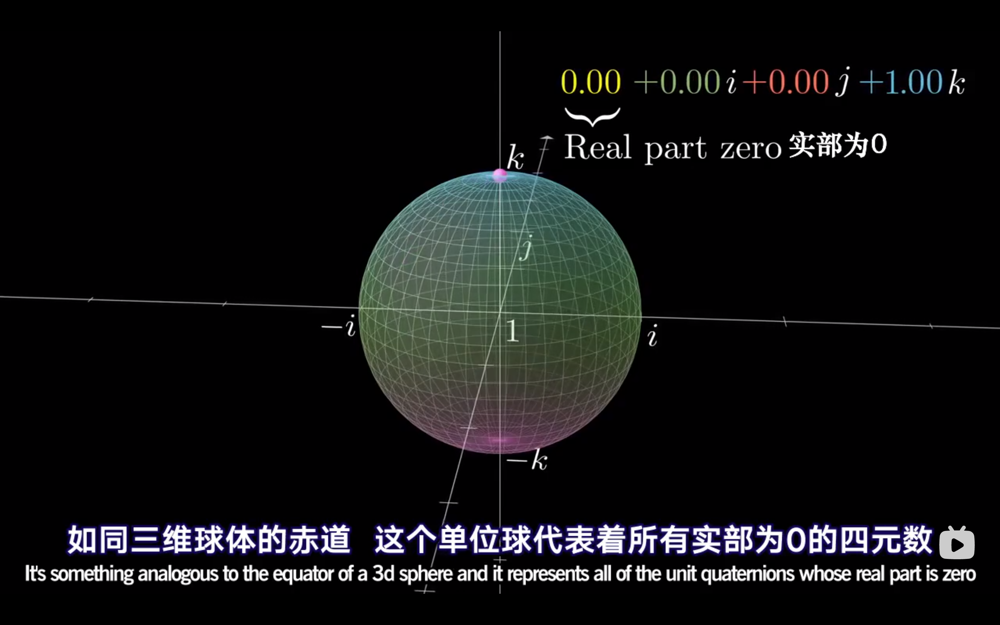

#! https://zhuanlan.zhihu.com/p/412466222

# SLAM 十四讲作业及答案 - 2

## Lecture 2

### Q1 熟悉 Eigen 矩阵运算

Eigen（http://eigen.tuxfamily.org）是常⽤的 C++ 矩阵运算库，具有很⾼的运算效率。⼤部分需要在 C++ 中使⽤矩阵运算的库，都会选⽤ Eigen 作为基本代数库，例如 Google Tensorflow，GoogleCeres，GTSAM 等。本次习题，你需要使⽤ Eigen 库，编写程序，求解⼀个线性⽅程组。为此，你需要先了解⼀些有关线性⽅程组数值解法的原理。
设线性⽅程 Ax = b，在 A 为⽅阵的前提下，请回答以下问题：
1. 在什么条件下，x 有解且唯⼀？     
答： 
非齐次线性方程在A的秩与[A|B]的秩相同时方程有解，当R(A)=R(A,B)=n时方程有唯一解。
<br>

2. ⾼斯消元法的原理是什么？         
答：
[高斯消元法入门](https://blog.csdn.net/pengwill97/article/details/77200372)
[高斯消元的可视化视频](https://www.bilibili.com/video/BV1Ub411U767?from=search&seid=11274721862767203625&spm_id_from=333.337.0.0)
<br>

3. QR 分解的原理是什么？
答：
[QR 分解的解释](https://zhuanlan.zhihu.com/p/84415000)
<br>

4. Cholesky 分解的原理是什么？
答：
简单来说 Cholesky 分解就是一种特殊的 LU 分解。当矩阵 A 是 SPD 矩阵（对称正定矩阵），那么此时可以得到一个 $ U = L^{T}$ 的分解。（注意，此时L的对角线元素不一定是1）
    * 对称：$A^T = A$
    * 正定：$\forall v \neq 0, v^T Av > 0$

>参考： [Cholesky 分解的解释](https://zhuanlan.zhihu.com/p/112091443)


5. 编程实现 A 为 100 × 100 随机矩阵时，⽤ QR 和 Cholesky 分解求 x 的程序。你可以参考本次课⽤到的 useEigen 例程。
提⽰：你可能需要参考相关的数学书籍或⽂章。请善⽤搜索引擎。Eigen 固定⼤⼩矩阵最⼤⽀持到 50，所以你会⽤到动态⼤⼩的矩阵。

解：

```cpp
/* main.cpp */
#include <iostream>
#include <Eigen/Core>
#include <Eigen/Dense>

using namespace Eigen;
using namespace std;

#define MATRIX_SIZE 100

// 编程实现 A 为 100 × 100 随机矩阵时，⽤ QR 和 Cholesky 分解求 x 的程序
int main(int argc, char const *argv[])
{
    // 创建随机矩阵 A[100x100] 并输出
    Matrix<double, MATRIX_SIZE, MATRIX_SIZE> A
    = MatrixXd::Random(MATRIX_SIZE, MATRIX_SIZE);
    // cout << "Matrix A is: \n" << A << endl;

    // 创建随机
    Matrix<double, MATRIX_SIZE, 1> B = MatrixXd::Random(MATRIX_SIZE, 1);
    // cout << "Matrix B is: \n" << B << endl;

    // 求解 Ax = B
    // 1. QR 分解
    auto x = A.colPivHouseholderQr().solve(B);
    cout << "QR decompostion: \n x = " << x << endl << endl; 

    // 2. Cholesky 分解
    auto y = A.ldlt().solve(B);
    cout << "Cholesky decompostion: \n x = " << y << endl; 

    return 0;
}
```


```makefile
#CmakeLists.txt
cmake_minimum_required(VERSION 2.8)
project(Q1)

set(CMAKE_BUILD_TYPE "Release")
set(CMAKE_CXX_FLAGS "-O3")

# 添加Eigen头文件
include_directories("/usr/include/eigen3")
add_executable(Q1ans main.cpp)
```


### Q2 几何运算练习

下⾯我们来练习如何使⽤ Eigen/Geometry 计算⼀个具体的例⼦。设有⼩萝⼘ 1 ⼀号和⼩萝⼘⼆号位于世界坐标系中。⼩萝⼘⼀号的位姿为： q 1 = [0.55, 0.3, 0.2, 0.2], t 1 =[0.7, 1.1, 0.2] T （q 的第⼀项为实部）
。这⾥的 q 和 t 表达的是 T cw ，也就是世界到相机的变换关系。⼩萝⼘⼆号的位姿为 q 2 = [−0.1, 0.3, −0.7, 0.2], t 2 = [−0.1, 0.4, 0.8] T 。现在，⼩萝⼘⼀号看到某个点在⾃⾝的坐标系下，坐标为 p 1 = [0.5, −0.1, 0.2] T ，求该向量在⼩萝⼘⼆号坐标系下的坐标。请编程实现此事，并提交你的程序。
提⽰：
1. 四元数在使⽤前需要归⼀化。
2. 请注意 Eigen 在使⽤四元数时的虚部和实部顺序。
3. 参考答案为 p 2 = [1.08228, 0.663509, 0.686957] T 。你可以⽤它验证程序是否正确。

>做题之前，可以先看查看下列链接，以便帮助你更好的了解四元数

[3blue1brown 解释四元数『熟肉』on bilibili](https://www.bilibili.com/video/BV1SW411y7W1?spm_id_from=333.999.0.0 "card")

[有关四元数的文章+视频『生肉』](https://eater.net/quaternions "card")


解：

```cpp
/* main.cpp */
#include <iostream>
#include <cmath>
#include <Eigen/Core>
#include <Eigen/Geometry>

using namespace std;
using namespace Eigen;

int main(int argc, char const *argv[])
{
    // 创建两个四元数(首位是实数)，并归一化
    Quaterniond q1(0.55,0.3,0.2,0.2);
    Quaterniond q2(-0.1,0.3,-0.7,0.2);
    // 归一化可以使四元数生成正交矩阵(注意没有d)
    q1.normalize();
    q2.normalize();

    // 创建两个位移向量
    Vector3d t1(0.7,1.1,0.2);
    Vector3d t2(-0.1,0.4,0.8);

    // 创建 点 p_1
    Vector3d p_1(0.5,-0.1,0.2);

    // 旋转矩阵1
    Isometry3d T1 = Isometry3d::Identity();                // 矩阵初始化
    T1.rotate(q1);                                     
    T1.pretranslate(t1);     

    // 旋转矩阵2
    Isometry3d T2 = Isometry3d::Identity();                // 矩阵初始化      
    T2.rotate(q2);                                     
    T2.pretranslate(t2); 

    // 通过一次变换得到 p 点的世界坐标
    // 第二次变换得到 p 点在 2 号的坐标
    Vector3d p_2 =T2 * T1.inverse() * p_1;


    cout << p_2.transpose() << endl;
    return 0;
}
```

### Q3 旋转的表达

课程中提到了旋转可以⽤旋转矩阵、旋转向量与四元数表达，其中旋转矩阵与四元数是⽇常应⽤中常见的表达⽅式。请根据课件知识，完成下述内容的证明。

1. 设有旋转矩阵 $R$，证明 $R^T R = I$ 且 $det(R) = +1^2$ 

解：
$$
\begin{aligned}    
&\because R\,\,is\,\,orthoronomal \\
&\therefore R^{-1} = R^T \\
&\therefore R^TR = R^{-1}R = I \\ \\
&\because during\,\,rotation\,\,the\,\,basics\,\,vectors\,\,are\,\,not\,\,scaled\\
&\therefore det(R) = i\times{j} = +1^2
\end{aligned}
$$

2. 设有四元数 $q$，我们把虚部记为 $ε$，实部记为 $η$，那么 $q = (ε, η)$。请说明 $ε$ 和 $η$ 的维度。

答：

$ε$ 是3维，$η$ 是1维

3. 定义运算$^+$和$^⊕$为：

$$
\begin{aligned}
    q^{+}=
    \begin{bmatrix}
        \eta^1 - \epsilon^\times & \epsilon \\
        -\epsilon^T & \eta \\
    \end{bmatrix},
        q^{\oplus}=
    \begin{bmatrix}
        \eta^1 + \epsilon^\times & \epsilon \\
        -\epsilon^T & \eta \\
    \end{bmatrix}
\end{aligned}
$$
请证明对任意单位四元数 $q_1$ , $q_2$ ，四元数乘法可写成矩阵乘法：

$$
q_1 · q_2 = q_1^+q_2
$$

或：

$$
q_1 · q_2 = q_1^{\oplus}q_2
$$

解：
网络上已经有很不错的解答了，所以为就偷了一个懒。

> 参考：https://blog.csdn.net/xuehuafeiwu123/article/details/74317286

> tips:
> Linux 系统中可以使用 [Matlab Online](https://matlab.mathworks.com/) 协助计算


### Q4 罗德里格斯公式的证明

罗德⾥格斯公式描述了从旋转向量到旋转矩阵的转换关系。设旋转向量长度为 θ，⽅向为 n，那么旋转矩阵 R 为：

$$
R = cosθI − (1 − cos θ)nn^T + sin θn^∧ 
$$

解：

> 参考： https://en.wikipedia.org/wiki/Rodrigues%27_rotation_formula

后面还有一些习题，基本都可以通过前面的课程学习到，下面不再演示。