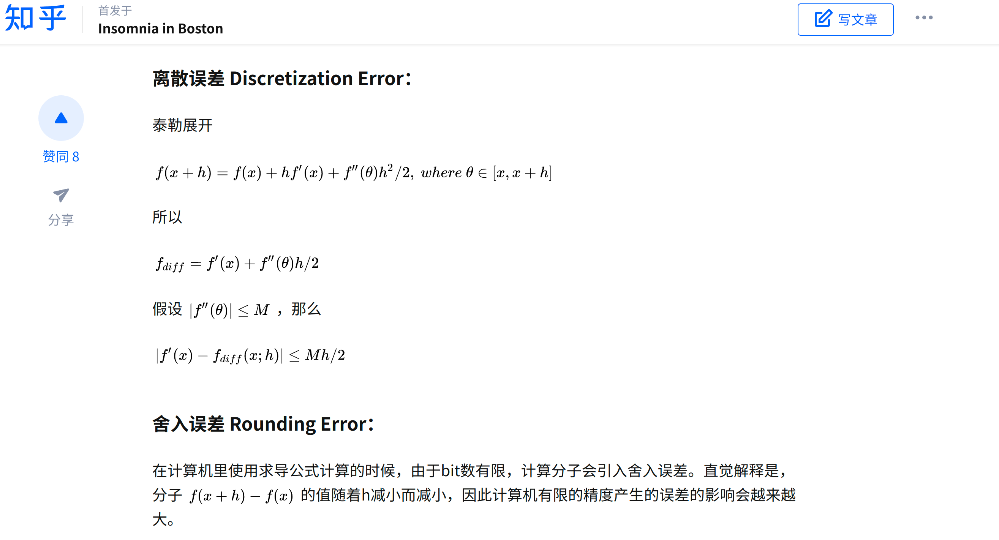
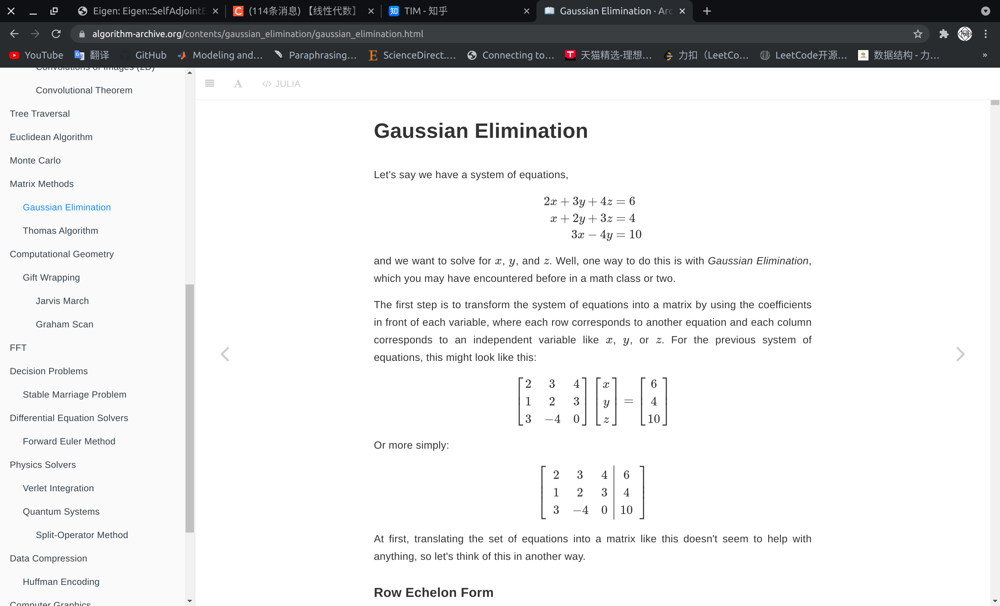
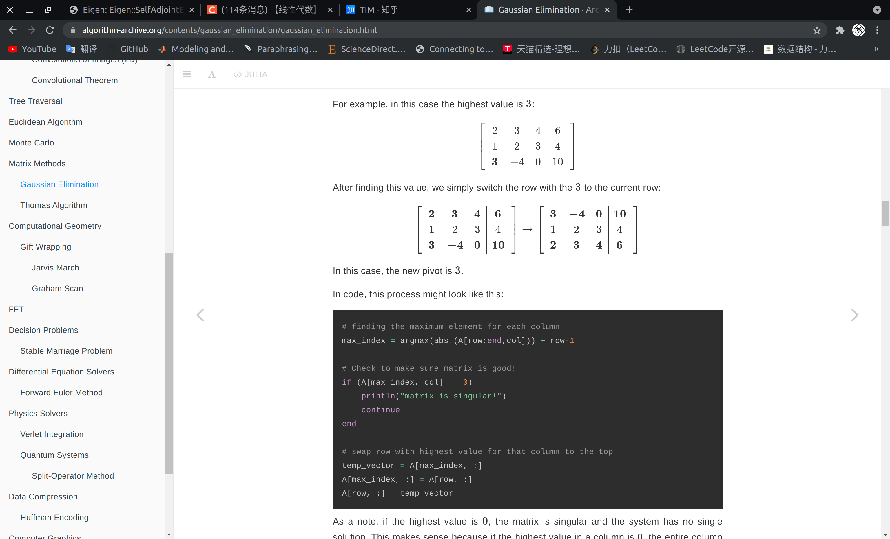
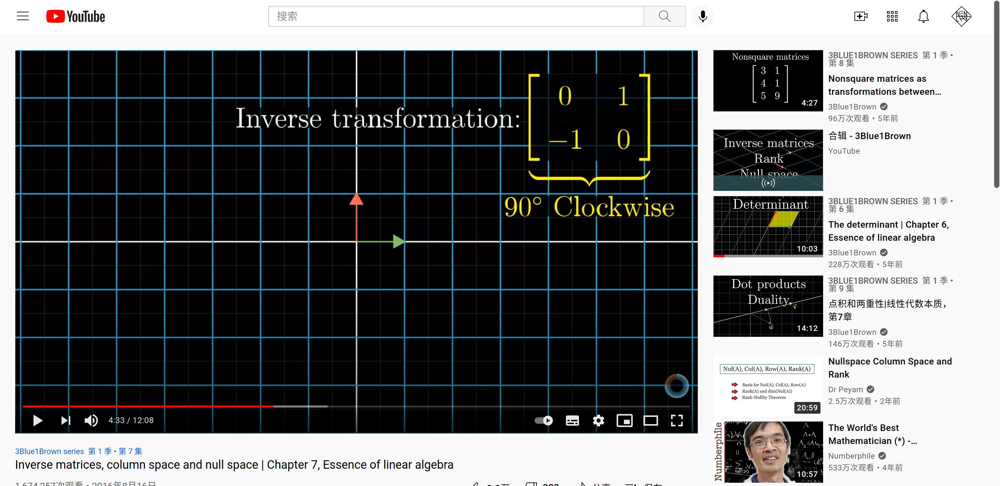
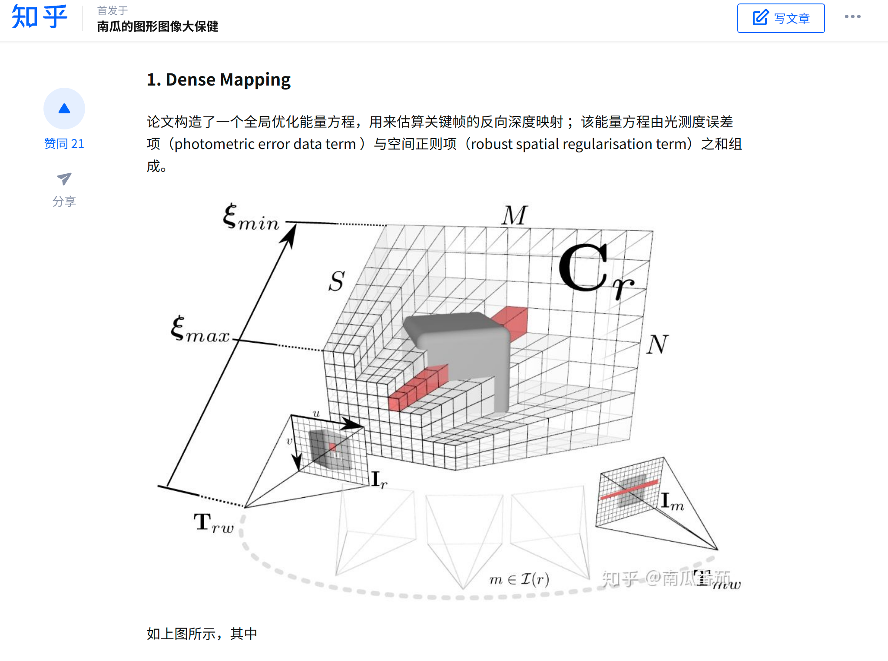
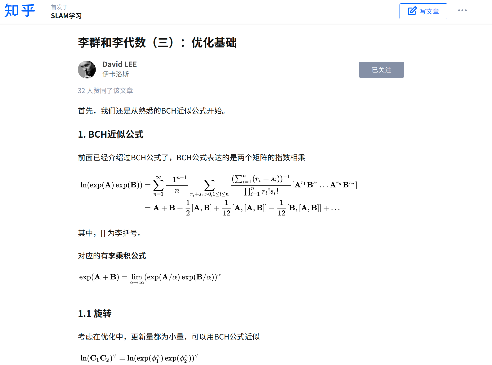

#! https://zhuanlan.zhihu.com/p/411457006
# 与 SLAM 有关的数学资料 

> 持续更新中

## 一些资料合集

[知乎上数学资料](https://zhuanlan.zhihu.com/p/95831124 "card")

>这些资料是[@YcoFlegs](https://www.zhihu.com/people/ysgc)创作，个人感觉质量非常的好，值得收藏。

---

[一本算法书『英文的』](https://www.algorithm-archive.org/ "card")

>这是一本包含了很多算法的数学书，书里不光有数学知识还包括如何实现算法的代码。另外书的排版很漂亮我很喜欢。

---

[3blue1brown 的 youtube 频道](https://www.youtube.com/watch?v=Ip3X9LOh2dk "card")
[3blue1brown 的b站频道](https://space.bilibili.com/88461692?spm_id_from=333.788.b_765f7570696e666f.2 "card")

>博主用可视化的方式把数学知识讲出来，真的很容易理解。并且视频数量很多，每一个视频的质量都很好。

...

## 一些零散的数学资料

[DTAM](https://zhuanlan.zhihu.com/p/42137963 "card")

---

**李群和李代数集合**
[李群和李代数1](https://zhuanlan.zhihu.com/p/76959511)
[李群和李代数2](https://zhuanlan.zhihu.com/p/77576417)
[李群和李代数3](https://zhuanlan.zhihu.com/p/80663767)

> 讲得很透彻！

...