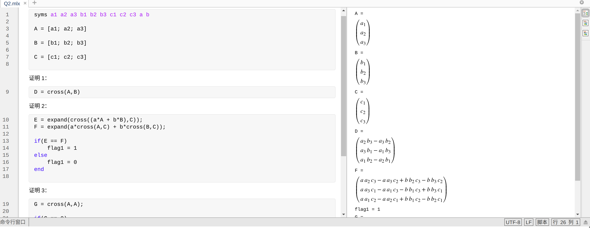

# SLAM 十四讲作业及答案 - 3

## Lecture 3

### Q1 群的性质

课上我们讲解了什么是群。请根据群定义，求解以下问题：
1, {Z, +} 是否为群？若是，验证其满⾜群定义；若不是，说明理由。

答：

{Z, +} 是群，证：

1. 封闭性：$\forall Z_1,Z_2 \in \Z, Z_1+ Z_2 \in \Z$
2. 结合律：$\forall Z_1,Z_2,Z_3 \in \Z, (Z_1 + Z_2) + Z_3 = Z_1 + (Z_2 + Z_3) $
3. 幺元： $\exist Z_0 \in Z, s.t. \forall Z \in \Z, Z_0 + Z = Z + Z_0 = Z. (Z_0 = 0)$
4. 逆： $\forall Z \in \Z, \exist Z^{-1} = -Z \in \Z, s.t. Z + Z^{-1} = Z - Z = Z_0 = 0$

2, {N, +} 是否为群？若是，验证其满⾜群定义；若不是，说明理由。
其中 Z 为整数集，N 为⾃然数集。

答：

{N, +} 不是群，因为 自然数 N 中没有负数。

### Q2 验证向量叉乘的李代数性质

我们说向量和叉乘运算构成了李代数，现在请你验证它。书中对李代数的定义为：李代数由⼀个集合 $V$，和一个数域 $F$ 和一个二元运算 [,]组成。

如果它们满⾜以下⼏条性质，称 $V, F, [, ]$ 为⼀个李代数，记作
$g$。
1. 封闭性 $∀X, Y ∈ V, [X, Y ] ∈ V$
2. 双线性 $∀X, Y , Z ∈ V, a, b ∈ F$, 有：$[aX + bY , Z] = a[X, Z] + b[Y , Z]$
3. 自反性 $[Z, aX + bY ] = a[Z, X] + b[Z, Y ]. ∀X ∈ V, [X, X] = 0.$
4. 雅可比等价 $∀X, Y , Z ∈ V, [X, [Y , Z]] + [Y , [Z, X]] + [Z, [X, Y ]] = 0.$

其中⼆元运算被称为李括号。

现取集合 $V = \R^3$ ，数域$F = \R$，李括号为：
 $$[a, b] = a × b.$$
请验证 $g = (R^3 , R, ×)$ 构成李代数。

> tips: 使用 matlab online 进行运算



证明：

1. 封闭性 $∀X, Y ∈ \R^3, [X \times Y ] ∈ \R^3$
2. 双线性 $∀X, Y , Z ∈ \R^3, a, b ∈ \R$, 有：$(aX + bY)\times Z = a[X\times Z] + b[Y \times Z]$
3. 自反性 $∀X ∈ \R^3, X\times X = 0$
4. 雅可比等价 $∀X, Y , Z ∈ \R ^ 3, (X \times (Y \times Z)) + (Y \times (Z\times X)) + (Z\times(X \times Y )) = 0.$

>Matlab 代码如下：

```matlab
syms a1 a2 a3 b1 b2 b3 c1 c2 c3 a b 

A = [a1; a2; a3]

B = [b1; b2; b3]

C = [c1; c2; c3]

证明 1：
D = cross(A,B)
证明 2：
E = expand(cross((a*A + b*B),C));
F = expand(a*cross(A,C) + b*cross(B,C));

if(E == F)
    flag1 = 1
else
    flag1 = 0
end

证明 3：
G = cross(A,A);

if(G == 0)
    flag2 = 1
else
    flag2 = 0
end
证明 4 ：
H = cross(A,cross(B,C)) + cross(B,cross(C,A)) + cross(C,cross(A,B));
H = expand(H);

if(H == 0)
    flag3 = 1
else
    flag3 = 0
end
```

### Q3 推导 SE(3) 的指数映射

课上给出了 SO(3) 的指数映射推导，但对于 SE(3)，仅介绍了结论，没有给出详细推导。请你完成 SE(3) 指数映射部分，有关左雅可⽐的详细推导。
设 $ξ = [ρ, ϕ]^T ∈ se(3)$，它的指数映射为：

$$
\exp(\xi ^{\wedge}) = 
\left\lbrack
\begin{array}{lr}  
    \sum_{n=0}^\infty \frac{1}{n!}(\phi^\wedge)^n & \sum_{n=0}^\infty \frac{1}{n+1)!!}(\phi^\wedge)^n\rho \\
    0^T &
    1 \\
\end{array}
\right\rbrack
$$

令 $\phi = \theta a$，那么：

$$
\begin{aligned}
    \sum_{n=0}^{\infty}\frac{1}{(n+1)!}(\phi ^ \wedge)^n
    = \frac{sin\theta}{\theta}I +
      (1 - \frac{sin\theta}{\theta})aa^T +
      \frac{1-cos\theta}{\theta}a^\wedge 
      \triangleq J
\end{aligned}
$$

> 这里关于 R 的证明，在书中已经给出答案了，就不再验证，关键是对于 $J\rho$的求解。方法与书中一样，但多了很多计算量，使用 matlab 不太好计算，参考：https://blog.csdn.net/hitljy/article/details/106586947

https://math.stackexchange.com/questions/2190603/derivation-of-adjoint-for-so3

